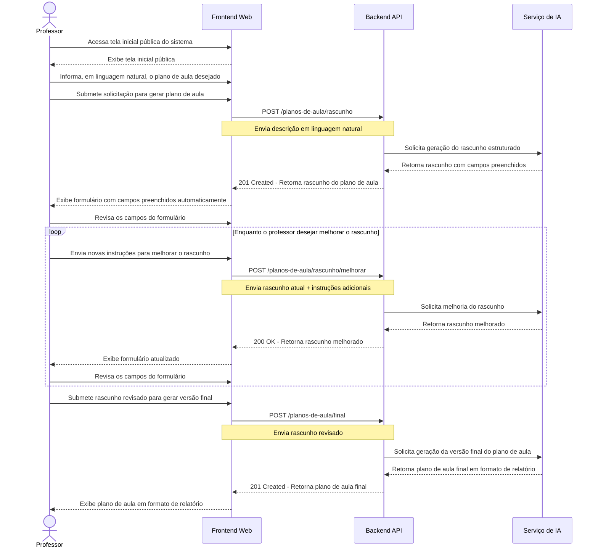

# MeuPlano.AI

Professores gastam muito tempo criando planos de aula claros, organizados e adaptados a diferentes turmas.

O **MeuPlano.AI** usa Inteligência Artificial para gerar sugestões estruturadas de planos de aula, permitindo que o professor revise, edite e salve seus planejamentos com mais rapidez.

> Este projeto é exclusivo para fins didáticos para a disciplina de **Desenvolvimento Full Stack** do curso de Especialização em Desenvolvimento Full Stack do IF Sudeste MG - *Campus* Manhuaçu, ofertado pelo [Prof. Dr. Filipe Fernandes](filipefernandesphd.com).

## App online

- **Frontend (Vercel):** https://dev-fullstack-sigma.vercel.app
- **Backend (Render):** https://meuplano-ai.onrender.com

A API no Render é free tier e "dorme" quando fica sem uso, então a primeira chamada pode levar uns 50s pra acordar.

## Como rodar localmente

Backend (em `./backend`): `npm install`, `npm run dev`, `npm test`, `npm run build`. API em `http://localhost:3333`, docs em `/docs`.

Frontend (em `./frontend`): `npm install`, `npm run dev`, `npm test`, `npm run build`. App em `http://localhost:5173`.

Via Docker (na raiz): `docker compose up -d` (sobe backend, frontend, ollama e mongodb).

## Variáveis de ambiente

Backend (`backend/.env.development`, baseado em `backend/.env.example`):

- `AI_API_URL`, `AI_MODEL`, `AI_API_KEY`: integração com a IA (Google Gemini, free tier).
- `AI_TIMEOUT_MS`: tempo máximo de espera pela IA (opcional).
- `MONGO_URL`: conexão com o MongoDB. Se vazia, a persistência fica desligada (não derruba a requisição).
- `CORS_ORIGIN`: origem liberada para o frontend.

Frontend (`frontend/.env.development`): `VITE_API_URL` apontando para a API.

## Deploy

- **MongoDB Atlas:** cluster free M0; a string de conexão vira `MONGO_URL` no Render.
- **Render (backend):** configurar `AI_*`, `MONGO_URL` e `CORS_ORIGIN` (com o domínio do Vercel). A porta vem de `PORT`.
- **Vercel (frontend):** configurar `VITE_API_URL` apontando para a API no Render **antes** do build (o Vite "inlina" essa variável no build).

## Estrutura do Projeto

O mono-repositório contém a implementação do app **MeuPlano.AI** e está estruturado da seguinte forma:

* **[backend](./backend):** implementação da API;
* **[docs](./docs)**: documentação para gerência e implementação da aplicação;
* **[frontend](./frontend)**: implementação da interface do usuário;

## Use Cases

Descrição dos principais fluxos do app **MeuPlano.AI**.

### UC01 - Gerar Plano de Aula

**Ator principal**: Professor

**Pré-condições**:

* O sistema deve estar disponível.
* A integração com o serviço de IA deve estar configurada.

**Pós-condições**:

* O professor obtém um plano de aula.
* O professor salva o plano em sua conta.
* O professor exporta o plano em PDF.

**Fluxo Principal**:

1. O professor acessa a tela inicial pública do sistema.
2. O professor informa, em linguagem natural, o plano de aula que deseja gerar.
3. O professor submete a requisição para gerar o plano de aula.
4. O sistema exibe um formulário com os campos preenchidos automaticamente.
5. O professor revisa os campos do formulário.
6. O professor submete a requisição para gerar a versão final do plano de aula.
7. O sistema exibe o plano de aula em formato de relatório e o caso de uso termina.

**Fluxo Alternativo**:

* 3.1. Caso o professor não esteja autenticado, o app requisitará sua autenticação, executa o passo 3 e retorna para o passo 4.
* 5.1. O professor edita os campos manualmente e segue para o passo 6.
* 5.2. O professor envia outras instruções para a IA e retorna para o passo 5.
* 7.1. O professor salva o plano de aula e o caso de uso termina.
* 7.2. O professor exporta o plano de aula como PDF e o caso de uso termina.

### Fluxo Principal - UC01 - Gerar Plano de Aula

